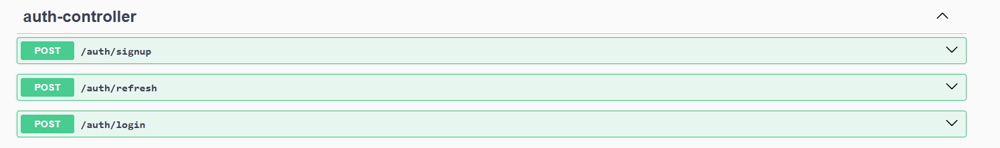
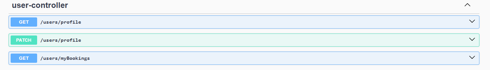
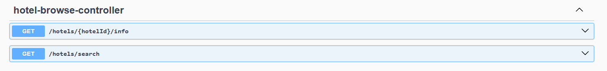
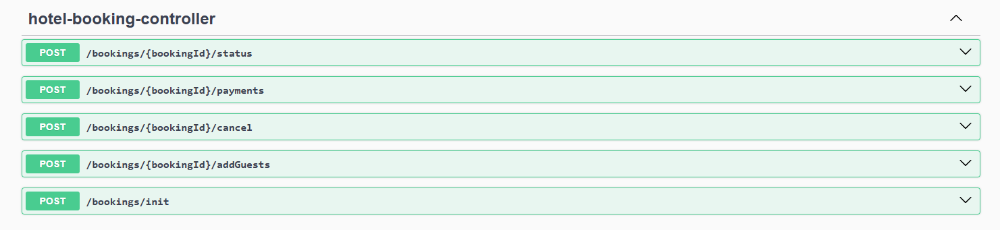
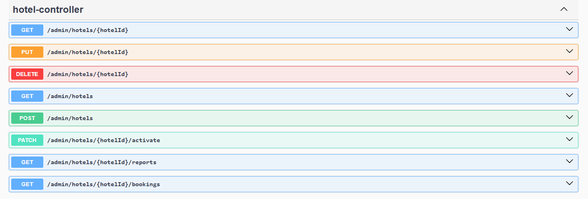

# BookingBlock - Hotel Management Backend

A robust, scalable backend for a multi-tenant hotel management platform. Hollux empowers users to book hotels, publish their own listings, and enables admins to oversee the entire marketplace. Built with Spring Boot and PostgreSQL, Hollux delivers secure, real-time hotel booking and management capabilities.

## 🚀 Features

- **JWT Authentication & Authorization:** Secure endpoints and user data with industry-standard token-based security.
- **Hotel Publishing & Booking:** Users can list their hotels and guests can book rooms with real-time availability.
- **Inventory & Locking:** Prevents overbooking and ensures data integrity during concurrent requests.
- **Dynamic Pricing Engine:** Implements the Strategy pattern for flexible, rule-based pricing.
- **Payment Integration:** Seamless and secure payment gateway for transactions.
- **Yearly Reports:** Generate detailed financial and operational reports for admins and hotel owners.
- **Modular Architecture:** Clean separation of concerns using DTOs, entities, and service layers.
- **Real-Time Availability:** Instantly reflects room status and inventory changes.

## 🏗️ Tech Stack

- **Spring Boot** – Rapid development and robust REST API support
- **PostgreSQL** – Reliable, scalable relational database
- **Lombok** – Boilerplate reduction for cleaner code
- **JUnit** – Automated testing
- **Postman** – API documentation and testing

## 🛣️ API Endpoints

Below are some of the key RESTful API endpoints provided by Hollux. For full details and request/response examples, see the Postman collection in the repository.

### Authentication


## User Controller


### Hotel Controller


### Hotel Booking Controller


### Admin Controller



---

For more endpoints and usage details, refer to the API documentation and Postman collection included

## 📦 Project Structure

```
src/
├── main/
│   ├── java/
│   │   └── com/example/projects/HolluxApp/
│   │       ├── dto/           # Data Transfer Objects (e.g., BookingDto, GuestDto)
│   │       ├── entity/        # Database entities (e.g., Booking, Guest, Hotel)
│   │       ├── repository/    # Spring Data JPA repositories (e.g., BookingRepository)
│   │       ├── service/       # Business logic and services (e.g., BookingService, PaymentService)
│   │       ├── controller/    # REST API controllers (e.g., BookingController, HotelController)
│   │       ├── strategy/      # Pricing strategies and related patterns
│   │       ├── config/        # Configuration classes (e.g., SecurityConfig, SwaggerConfig)
│   │       ├── util/          # Utility/helper classes
│   │       └── HolluxApplication.java
│   └── resources/
│       ├── application.properties
│       └── static/          
│       └── templates/         
└── test/

```

## 📖 Example DTO

```java
@Data
public class BookingDto {
    private Long id;
    private Integer roomsCount;
    private LocalDate checkInDate;
    private LocalDate checkOutDate;
    private LocalDateTime createdAt;
    private LocalDateTime updatedAt;
    private BookingStatus bookingStatus;
    private Set<GuestDto> guests;
    private BigDecimal amount;
}
```

## 🛠️ Getting Started

1. **Clone the repository:**
   ```
   git clone https://github.com/yourusername/BookingBlock.git
   ```
2. **Configure PostgreSQL** in `application.properties`.
3. **Build and run:**
   ```
   ./mvnw spring-boot:run
   ```
4. **Test APIs** using Postman collections provided in the repo.

## 📈 Contributing

Pull requests are welcome! For major changes, please open an issue first to discuss what you would like to change.

## 📄 License

This project is licensed under the MIT License.

---

**BookingBlock** – Powering the next generation of hotel management
